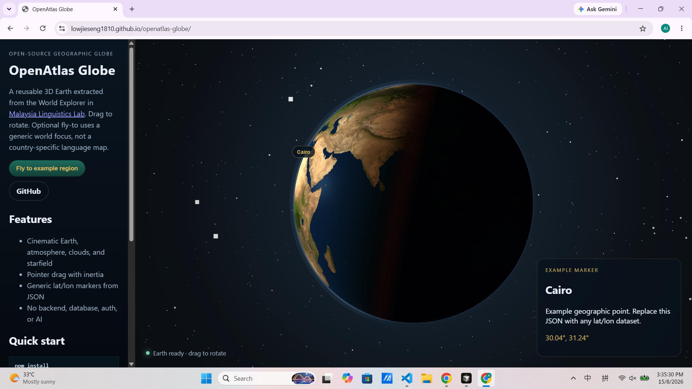
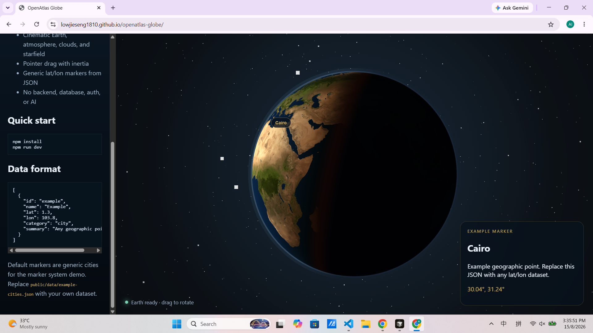

# OpenAtlas Globe

An open-source, reusable 3D Earth for geographic exploration.

Interactive Three.js globe with realistic terrain and ocean textures, atmosphere, clouds, stars, automatic axial rotation, and a spherical day/night terminator. Plot generic lat/lon markers from JSON — no backend required.

## What it is

OpenAtlas Globe is a standalone Vite demo of a cinematic Earth renderer. Use it as a geographic visualization component: drag to orbit, fly to a region, drop JSON markers, and keep the planet spinning under simulated sunlight.

It is not a language-learning app and does not ship Malaysia-specific course data.

## Features

- Interactive 3D Earth (Three.js)
- Realistic day, normal, specular, and cloud textures
- Atmosphere (inner + outer Fresnel limb)
- Cloud layer and starfield
- Automatic Earth-axis rotation (optional, pause while dragging)
- Real-time day/night lighting with a spherical terminator
- Geographic markers from JSON
- Responsive layout (sidebar stacks on small screens)
- GitHub Pages static deploy
- No server, database, login, or AI API

## Demo

**Live demo:** https://lowjieseng1810.github.io/openatlas-globe/

```bash
npm install
npm run dev
```

Then open the URL Vite prints (default `http://127.0.0.1:5173`).

## Screenshots / Media





GitHub README Markdown does not play video files inline. Watch the short capture here: [openatlas-globe-demo.mp4](openatlas-globe-demo.mp4).

## Quick Start

Requires Node.js 20+.

```bash
git clone https://github.com/lowjieseng1810/openatlas-globe.git
cd openatlas-globe
npm install
npm run dev
```

Production build:

```bash
npm run build
npm run preview
```

## Usage

1. Mount a `#globe-stage` element (required by the renderer).
2. Optionally provide `#explore-world-button` for cinematic fly-to and `#auto-rotate` for axial spin.
3. Set focus coordinates before the globe boots:

```ts
window.OPENATLAS_GLOBE = {
  focusLat: 3.14,
  focusLon: 101.69,
};
```

4. After `earthExplorerReady`, use `window.EarthExplorer.projectLatLon(lat, lon)` to place HTML markers, and `setAutoRotate(boolean)` to control idle spin.

The demo does this in `src/main.ts` and `src/demo/markers.ts`.

## Data Format

Generic points, not a country-specific schema:

```json
[
  {
    "id": "example",
    "name": "Example",
    "lat": 1.3,
    "lon": 103.8,
    "category": "city",
    "summary": "Any geographic dataset: heritage, migration, education, research, routes."
  }
]
```

Replace `public/data/example-cities.json` with your own file. Default markers are generic cities (Cairo, Reykjavík, Wellington).

## Architecture

```
openatlas-globe/
  index.html                 # demo page / introduction
  public/textures/earth/     # Earth maps
  public/data/               # example geographic JSON
  src/globe/earth-globe.js   # Three.js renderer, shaders, lighting, drag, fly-to
  src/globe/spin.ts          # auto-rotate timing helpers
  src/globe/geo.ts           # lat/lon helpers + JSON parser
  src/demo/                  # standalone UI / markers
  src/config.ts              # demo focus coordinates
  ATTRIBUTIONS.md
  LICENSE
```

The Earth mesh rotates around its polar axis for auto-rotate. A distant sun position drives shader lighting, so the day/night terminator moves as the planet turns. Pointer drag pauses auto-rotate and either orbits the camera (idle) or yaws the planet group (after fly-to).

## Customization

| Option | Where | Effect |
| --- | --- | --- |
| `focusLat` / `focusLon` | `window.OPENATLAS_GLOBE` | Fly-to target |
| `assetBaseUrl` | `window.OPENATLAS_GLOBE` | Override texture directory |
| Textures | `public/textures/earth/` | Day / normal / specular / clouds |
| Marker dataset | `public/data/*.json` | Any lat/lon collection |
| Demo chrome | `index.html`, `src/demo/styles.css` | Layout only |

## Technology

- TypeScript (demo shell, data helpers, tests)
- Three.js `0.128.0`
- Vite
- HTML/CSS for the demo chrome

## Performance

- Default day map is `earth_day_8k.jpg` (~4.5 MB). First load is texture-bound.
- Pixel ratio is capped at 2.
- Auto-rotate uses the existing `requestAnimationFrame` loop (no extra loops).
- For weaker devices, swap in a smaller day texture via `public/textures/earth/`.

## Origin & Attribution

The renderer is derived from the World Explorer Earth implementation originally developed for Malaysia Linguistics Lab, extracted so it can run as a standalone geographic globe.

- Original GitHub repository: [https://github.com/lowjieseng1810/malaysia-linguistics-lab](https://github.com/lowjieseng1810/malaysia-linguistics-lab)
- Original website: [https://malaysialinguisticlab.com/](https://malaysialinguisticlab.com/)

See [ATTRIBUTIONS.md](ATTRIBUTIONS.md) for textures and third-party notices.

## Contributing

Issues and pull requests are welcome. Keep changes focused on the globe runtime or demo. Do not add a backend, database, authentication, or AI client.

## License

MIT License. See [LICENSE](LICENSE).
